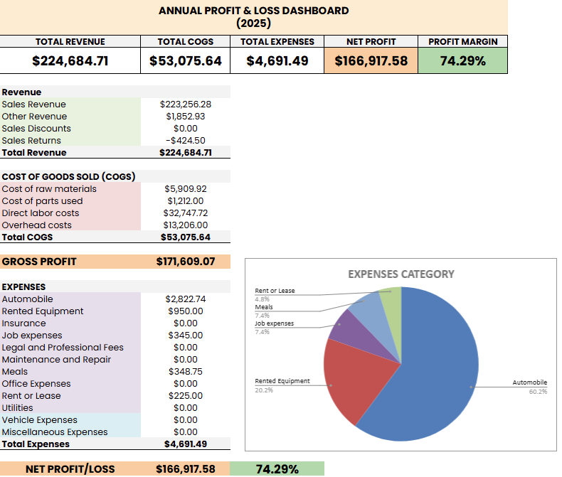

# 📊 Automated Financial Reporting Pipeline

### Transforming 107+ Unstructured Excel Files into an Interactive Financial Dashboard



---

## 🎯 Project Overview

Built an end-to-end automated data pipeline using Python to extract, clean, and transform messy financial data from 107 individual Excel files into professional Annual and Monthly Profit & Loss (P&L) reports. The project automated a process that would have taken 20+ hours of manual work into minutes, delivering accurate results within a tight 36-hour deadline.

---

## 💼 The Business Problem

A US-based event company needed to consolidate financial reports from 107 individual projects. Key challenges included:

- 📂 **Fragmented Data:** 107 separate Excel files with inconsistent filename formats (e.g., `1.5_1.16.2025`, `2.11-12.2025`)
- 🔄 **Shifting Row Positions:** Critical data positions (Gross Profit, Total Expenses) shifted between files due to variable "noise" rows (payment check numbers)
- 🗑️ **Noisy Data:** Advertisements and add-on instructions at the bottom of files needed to be ignored
- ⏰ **Tight Deadline:** Reports needed to be delivered within 36 hours

---

## 🛠️ Tech Stack

| Category | Tools |
|----------|-------|
| **Programming** | Python 3 |
| **Data Processing** | Pandas, Openpyxl |
| **Text Parsing** | Regular Expressions (Regex) |
| **Reporting** | Google Sheets (Advanced Formulas, Pivot Tables, Conditional Formatting) |
| **Visualization** | Google Sheets Charts, Sparklines |

---

## ⚙️ Technical Deep Dive: The Data Pipeline

### Phase 1: Data Ingestion & Filename Parsing

The first challenge was extracting metadata (Month, Year, Project Name) from highly inconsistent filenames. I used **Regular Expressions (Regex)** to parse varying date patterns.

```python
import re

def parse_filename(filename):
    """
    Extracts Month, Year, and Project Name from inconsistent filename formats.
    Input examples: '1.5_1.16.2025 - Project Name.xlsx', '2.11-12.2025 - Event.xlsx'
    """
    name = filename.replace('.xlsx', '')
    
    # Extract Month (first number)
    month_match = re.match(r'^(\d{1,2})', name)
    month = int(month_match.group(1)) if month_match else 0
    
    # Extract Year (4-digit number)
    year_match = re.search(r'(\d{4})', name)
    year = int(year_match.group(1)) if year_match else 2025
    
    # Extract Project Name (remove date prefix)
    project_name = re.sub(r'^\d{1,2}[.\-_]\d{1,2}[.\-_]?\d{0,2}\s*[-]?\s*', '', name)
    
    return month, year, project_name
python```

### Phase 2: Data Cleaning & Noise Reduction

Since row numbers shifted between files, a position-based approach (e.g., "get data from row 20") would fail. I designed a Keyword Search & State Machine algorithm to scan label columns.
Key Solutions:
✅ **Handling Shifting Rows**: Script scans Column C for specific keywords (TOTAL REVENUE, GROSS PROFIT) and retrieves corresponding values, ignoring row shifts
✅ **Removing Noise**: Ignores rows containing "Check#" or "Coefficient" (advertisement text)
✅ **Text Normalization**: Cleans category labels with dynamic descriptions in parentheses for proper grouping

```python
def clean_label(text):
    """
    Cleans category labels by removing text in parentheses.
    Input: 'Direct labor costs (Attendant Alex - $12)'
    Output: 'Direct labor costs'
    """
    if not text: return ""
    return text.split('(')[0].strip()

# State Machine logic to avoid 'noise' rows
if "TOTAL COGS" in text_c:
    data['Total COGS'] = val_e
    in_cogs_section = False  # Stop searching COGS details, avoid 'Check#' rows below
python```
