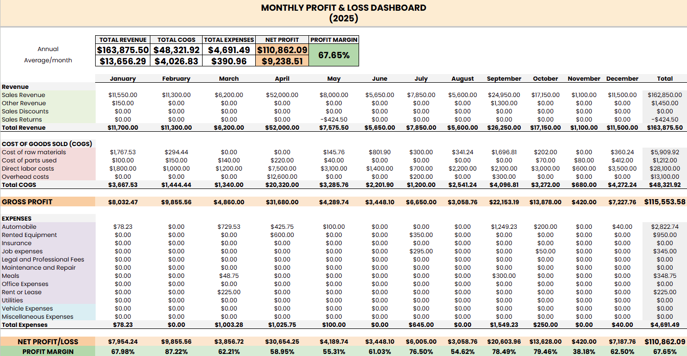

# 📊 Automated Financial Reporting Pipeline

### Transforming 107+ Unstructured Excel Files into an Interactive Financial Dashboard


---

## 🎯 Project Overview

Built an end-to-end automated data pipeline using Python to extract, clean, and transform messy financial data from 107 individual Excel files into Annual and Monthly Profit & Loss (P&L) reports. The project automated a process that would have taken 20+ hours of manual work into minutes, delivering accurate results within a tight deadline.

---

## 💼 The Business Problem

A US-based event company needed to consolidate financial reports from 107 individual projects. Key challenges included:

- 📂 **Fragmented Data:** 107 separate Excel files with inconsistent filename formats (e.g., `1.5_1.16.2025`, `2.11-12.2025`)
- 🔄 **Shifting Row Positions:** Critical data positions (Gross Profit, Total Expenses) shifted between files due to variable "noise" rows (payment check numbers)
- ⏰ **Tight Deadline:** Reports needed to be delivered within 36 hours

---

## 🛠️ Tech Stack

| Category | Tools |
| :--- | :--- |
| **Programming** | Python 3 |
| **Data Processing** | Pandas, Openpyxl |
| **Text Parsing** | Regular Expressions (Regex) |
| **Reporting** | Google Sheets (Advanced Formulas, KPI Scorecards, Conditional Formatting) |
| **Visualization** | Google Sheets Charts (Pie Charts) |
| **Development** | VS Code, Git, GitHub |

---

## ⚙️ Technical Deep Dive: The Data Pipeline

### Phase 1: Data Ingestion & Filename Parsing

The first challenge was extracting metadata (Month, Year, Project Name) from inconsistent filenames. I used Regular Expressions (Regex) to parse varying date patterns across 107 files

```python
import re

def parse_filename(filename):
    """
    Extracts Month, Year, and Project Name from inconsistent filename formats.
    Input examples: '1.5_1.16.2025 - Project Name.xlsx', '2.11-12.2025 - Event.xlsx'
    """
    name = filename.replace('.xlsx', '')
    
    # Extract Month (first number in filename)
    month_match = re.match(r'^(\d{1,2})', name)
    month = int(month_match.group(1)) if month_match else 0
    
    # Extract Year (4-digit number anywhere in filename)
    year_match = re.search(r'(\d{4})', name)
    year = int(year_match.group(1)) if year_match else 2025
    
    # Extract Project Name (remove date prefix with various separators)
    project_name = re.sub(r'^\d{1,2}[.\-_]\d{1,2}[.\-_]?\d{0,2}\s*[-]?\s*', '', name)
    
    return month, year, project_name
```


### Phase 2: Data Cleaning & Noise Reduction

Since row numbers shifted between files due to variable "noise" rows (payment check information, blank rows), a position-based approach (e.g., "get data from row 20") would fail. I designed a Keyword Search Algorithm to scan label columns dynamically.
```python
def extract_data_from_file(filepath):
    wb = load_workbook(filepath, data_only=True)
    ws = wb.active
    
    data = {key: 0 for key in TOTALS_IN_ORDER}
    for cat in CATEGORIES_IN_ORDER:
        data[cat] = 0

    # Scan rows 1-50 (covers all data sections + noise)
    for row_num in range(1, 51):
        cell_c = ws[f'C{row_num}']
        cell_e = ws[f'E{row_num}']
        
        if not cell_c.value:
            continue
            
        text_c = str(cell_c.value).upper()
        val_e = cell_e.value if cell_e.value is not None else 0
        
        # Match against TOTALS keywords
        for total_name in TOTALS_IN_ORDER:
            if total_name.upper() in text_c:
                data[total_name] = val_e
                break
        
        # Match against DETAIL CATEGORIES keywords
        for cat in CATEGORIES_IN_ORDER:
            if cat.upper() in text_c:
                data[cat] = val_e
                break

    wb.close()
    return data
```
Key Solutions Implemented:
- **Handling Shifting Rows**: Instead of hardcoding row numbers, the script scans Column C for specific keywords (TOTAL REVENUE, GROSS PROFIT, Direct labor costs, etc.) and retrieves corresponding values from Column E. This makes the extraction robust against row position changes.
- **Ignoring Noise Rows**: Rows containing "Check #101706 Alex Salinas" or "Coefficient" advertisements don't match any keywords in our target lists, so they're automatically skipped without requiring explicit filtering logic.
- **Handling Empty Values**: The script initializes all categories with 0 and only updates when a match is found, ensuring consistent output even when certain expense categories are unused in specific projects.
- **Flexible Label Matching**: Using if cat.upper() in text_c allows partial matching, so "Direct labor costs (Attendant Alex - $12)" successfully matches the keyword "Direct labor costs" without requiring exact string equality.


### Phase 3: Data Transformation & Aggregation

After extracting raw data from all 107 files into a list of dictionaries, I used Pandas to transform the data into a reporting-ready format.

```python
import pandas as pd

def main():
    all_data = []
    
    # Define final column order (metadata + totals + details)
    final_columns = ['Filename', 'Project Name', 'Month', 'Year'] + TOTALS_IN_ORDER + CATEGORIES_IN_ORDER

    for filename in os.listdir(FOLDER_PATH):
        if filename.endswith('.xlsx') and not filename.startswith('~$'):
            filepath = os.path.join(FOLDER_PATH, filename)
            
            month, year, project = parse_filename(filename)
            data = extract_data_from_file(filepath)
            
            row_data = {
                'Filename': filename,
                'Project Name': project,
                'Month': month,
                'Year': year
            }
            row_data.update(data)
            all_data.append(row_data)

    df = pd.DataFrame(all_data)
    
    # Sort chronologically
    df = df.sort_values(by=['Year', 'Month'])
    
    # Ensure consistent column order and fill missing values with 0
    df = df.reindex(columns=final_columns, fill_value=0)
    
    df.to_excel(OUTPUT_FILE, index=False)
```
Key Transformations:
- **Column Standardization**: The final_columns list enforces a consistent column order matching accounting standards, and then making the output immediately usable for reporting.
- **Chronological Sorting**: df.sort_values(by=['Year', 'Month']) organizes projects by time period, enabling easy monthly aggregation in the dashboard.
- **Missing Value Handling**: df.reindex(columns=final_columns, fill_value=0) ensures all 27 expected columns exist in every row, filling any missing categories with 0 for data consistency.
- **File Filtering**: The condition not filename.startswith('~$') excludes temporary Excel lock files that Windows creates when files are open, preventing extraction errors.


---

## 📈 The Output: Financial Dashboard
The pipeline produces an integrated, clean, and decision-ready Google Sheets file.
1. **Annual P&L with KPI Scorecard**

Provides an executive summary at the top with key metrics (Total Revenue, Total Expenses, Net Profit, Profit Margin) dynamically pulled from the database. Expense details are organized into clear categories as requested by the client.
2. **Monthly P&L Comparative Report**

Breaks down 12-month data into a horizontal format, enabling clients to compare spending month-to-month on an apple-to-apples basis. Includes Conditional Formatting (Green for profit, Red for loss) for easy visual reading.

---

## 💡 Key Takeaways
1. **Never Trust Raw Data**: Real-world data is almost always messy. Building robust logic (like keyword search instead of hard-coded row numbers) is crucial for scalability.
2. **Automation over Manual Work**: Automating the extraction of 107 files saved an estimated 20+ hours of manual work and eliminated human error risks (copy-paste mistakes).
3. **Business Context Matters**: Great Python code is meaningless if the final output isn't readable by business users. Report formatting and structure are as important as data cleanliness.


---

## How to Run This Project
1. Clone this repository
2. Install dependencies: pip install pandas openpyxl
3. Place your Excel files in the sample_data/ folder
4. Update FOLDER_PATH in scripts/extract_pnl.py
5. Run: python scripts/extract_pnl.py
6. Check the output/ folder for the consolidated data

--- 

## 📬 Contact
LinkedIn: [https://www.linkedin.com/in/mohfaurizarw]
Email: [fauriza29@gmail.com]

---
